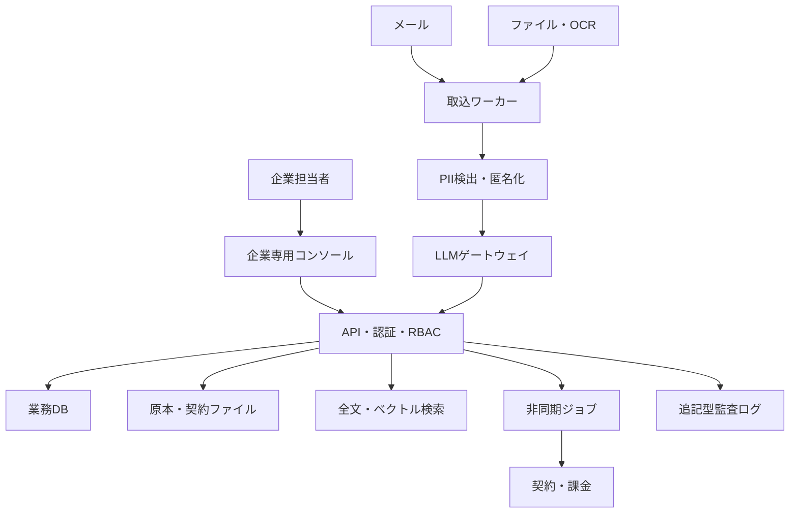
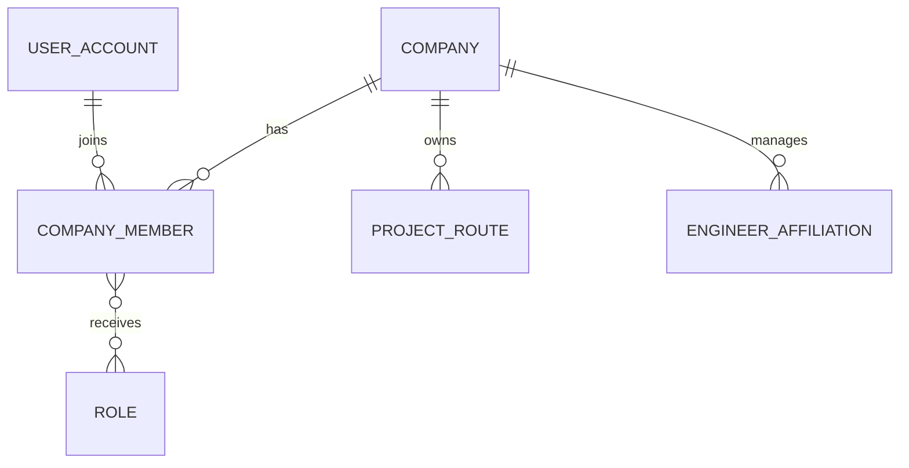
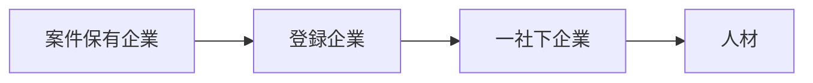
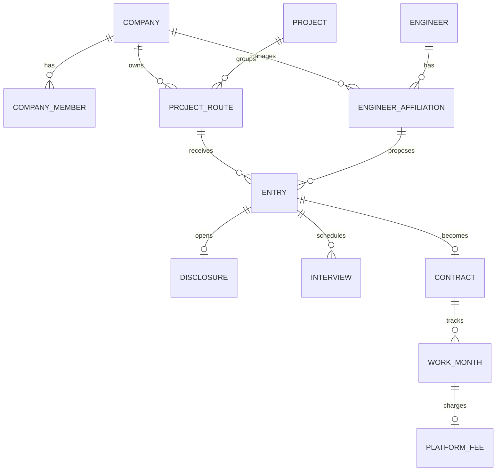

# SESマッチングプラットフォーム 完全版仕様書

| 項目 | 内容 |
|---|---|
| 文書名 | SESマッチングプラットフォーム 完全版仕様書 |
| バージョン | 2.0 |
| 作成日 | 2026-07-28 |
| 最終更新日 | 2026-08-14（改訂履歴は§38） |
| 対象 | 企業間SES案件・人材マッチング、企業コンソール、契約・課金 |
| 文書位置付け | 基本設計・詳細設計・画面・データ・API・運用要件の統合版 |

## 1. システム目的

本システムは、SES企業間で流通する案件情報と人材情報を、メール、ファイル、画面入力から収集し、PII匿名化およびLLM正規化を行ったうえで一元管理するB2Bプラットフォームである。

すべての契約ユーザーは企業・事業者であり、1企業に複数の担当者が所属する。各企業は独立した企業コンソールから、自社案件と自社管理人材の双方を取り扱い、案件から人材、人材から案件の双方向マッチング、商談（エントリー）、面談、契約、稼働、請求までを行う。

## 2. 基本原則

1. 契約主体はすべて企業または個人事業者とする。
2. 案件企業・人材企業という固定区分を設けない。
3. 需要側・供給側は取引ごとに決定する。
4. 1企業に複数担当者を登録できる。
5. 各企業は独立した企業コンソールで業務を行う。
6. 人材本人は原則としてログインユーザーにしない。
7. 個人事業主が直接利用する場合は個人アカウントではなく事業者テナントとして登録する。
8. 人材情報は3段階で開示し、デフォルトを最小開示とする。
9. 企業名は双方承認時に相互・同時開示する。
10. 案件・人材の再転載、無承認の再仲介、二社下以降を禁止する。
11. LLMには匿名化済みテキストだけを送信する。
12. 採否・契約判断をLLMだけで自動決定しない。

## 3. 対象業務

- 企業申込、審査、契約、企業コンソール開通
- 企業担当者、部署、ロール、権限管理
- 人材・スキルシート取込、匿名化、正規化
- 案件取込、正規化、名寄せ
- 案件・人材の公開
- 双方向マッチング
- 商談申込み（エントリー・スカウト）、双方承認（商談開始）
- メッセージ、面談、条件調整
- 基本契約、個別契約、注文書・注文請書
- 稼働開始、月次確認、更新、終了
- 成約手数料、請求、入金、返金
- 本人同意、訂正、削除、保存期限
- LLM、情報開示、契約、課金の監査

## 4. 対象外

- 二社下以降の人材流通
- プラットフォーム情報の外部再転載
- 性別、顔写真、出身国等によるスクリーニング
- 給与・社会保険・勤怠計算
- LLMによる完全自動採否
- 派遣契約の詳細管理機能
- 13稼働月目以降の成約手数料

## 5. システム構成

## 6. 企業・テナント

### 6.1 企業テナント

1企業・事業者につき1つの独立テナントを作成する。すべての自社データに`tenant_company_id`を付与し、他社データへ直接アクセスできないようにする。

### 6.2 企業形態

| コード | 内容 |
|---|---|
| CORPORATION | 法人 |
| SOLE_PROPRIETOR | 個人事業者 |

両者とも案件・人材の双方を取り扱える。

### 6.3 取引上の役割

| 役割 | 判定 |
|---|---|
| 需要側企業 | 対象案件ルートを保有する企業 |
| 供給側企業 | 対象人材への有効な提案権限を持つ企業 |
| 手数料負担企業 | 需要側企業 |
| 人材管理企業 | 所属・営業権限・本人同意を管理する企業 |

### 6.4 企業登録

1. 企業申込
2. 法人番号または事業者情報確認
3. 代表者・企業ドメイン確認
4. 企業オーナー登録
5. 規約・基本契約同意
6. 運営審査
7. 企業コンソール開通
8. 担当者招待
9. ロール付与
10. 案件・人材登録開始

## 7. 企業担当者管理

### 7.1 アカウントモデル

ログインアカウントと企業所属を分離する。

### 7.2 標準ロール

| ロール | 主な権限 |
|---|---|
| 企業オーナー | 企業契約、全権限、管理者指名 |
| 企業管理者 | 担当者、権限、企業設定 |
| 営業担当 | 案件、人材、マッチング、商談 |
| 人材管理担当 | 人材、スキルシート、本人同意、所属 |
| 案件管理担当 | 案件、候補、面談 |
| 契約担当 | 基本契約、個別契約、署名 |
| 経理担当 | 手数料、請求、入金、返金 |
| 個人情報管理者 | PII、訂正、削除、同意 |
| 監査担当 | 監査ログ閲覧 |
| 閲覧者 | 許可範囲の参照 |

1担当者に複数ロールを付与できる。

### 7.3 権限例

- `engineer.read.masked`
- `engineer.read.pii`
- `engineer.create`
- `engineer.publish`
- `project.create`
- `project.publish`
- `entry.submit`
- `entry.approve`
- `contract.sign`
- `billing.confirm`
- `privacy.process`
- `audit.read`

### 7.4 重要操作の分離

契約署名、高額返金、本人情報の物理削除、企業オーナー変更は申請者と承認者を分離できる。設定時は同一担当者による自己承認を禁止する。

### 7.5 認証

- メール認証
- 強固なパスワード
- TOTP MFA
- セッション一覧・全端末ログアウト
- ログイン履歴
- 一定回数失敗時の一時ロック
- 管理者、契約、経理、個人情報、運営担当はMFA必須
- 将来SAML/OIDC、SCIMに対応

### 7.6 退職・停止

1. ログイン・セッション・APIキーを停止
2. 主担当データを副担当へ移管
3. 副担当がいない場合は企業管理者へ移管
4. 署名・承認権限を解除
5. 業務・監査記録は企業データとして維持
6. 担当者個人情報は保存期限後に仮名化

## 8. 企業専用コンソール

### 8.1 基本方針

- ログイン後、所属企業コンソールを自動表示する。
- 案件・人材を同じコンソールで管理する。
- 自社情報は編集可能、他社情報は開示レベルに応じた参照のみとする。
- 他社情報のコピー・再公開を禁止する。
- 企業内でもロール・担当範囲に応じて閲覧を制御する。
- 案件・人材の一覧では、登録から1日（24時間）以内のレコードに新着印（小さな赤丸アイコン）を表示する（2026-08-14変更。旧: 7日以内に「NEW」文字）。
- PC・スマホの両方に対応する（レスポンシブ。2026-08-12追加）。スマホ（768px未満）ではサイドバーの代わりにドロワーメニューを表示し、ホームKPI・成約・稼働・成約手数料は案内しない（モバイルの起点は案件一覧。ログイン後遷移・ロゴ・PWAの起動画面も同様）。一覧はカード表示、詳細・フォームは1カラム表示とする。PWA（ホーム画面追加）に対応する。

### 8.2 メニュー

| メニュー | 機能 | モバイル |
|---|---|---|
| ホーム | KPI、対応待ち、警告 | 非表示（PC専用） |
| 案件 | 自社案件、公開案件検索、登録・更新、取込、マッチング（案件→人材） | 表示 |
| 人材 | 自社管理人材、公開人材検索、登録・更新、取込、マッチング（人材→案件） | 表示 |
| 取込履歴 | 人手確認待ちの確認・確定、取込履歴（2部構成。2026-08-13変更） | 表示 |
| 商談管理 | 商談申込みの送信・受信、承認、面談、メッセージ、条件確認書作成 | 表示 |
| 成約・稼働 | 条件確認書、署名、稼働開始・終了、月次稼働確認 | 非表示（PC専用） |
| 成約手数料 | 手数料、請求書 | 非表示（PC専用） |
| 操作マニュアル | 操作手順・用語 | 表示 |

企業情報・担当者・権限・通報・監査・プライバシー・企業間関係・レポートは、ヘッダーの会社名から開く会社マイページに集約する。

### 8.3 ホームKPI

- 公開中案件
- 営業中人材
- 推奨マッチ
- 承認待ちの商談申込み
- 面談予定
- 契約処理中
- 稼働中人数
- 今月手数料
- 同意・証憑期限
- 案件鮮度警告

### 8.4 企業内共有

MVPでは全社共有と担当者限定の2方式を提供する。案件・人材に主担当、副担当、承認者を設定する。

## 9. 情報入力

### 9.1 入力方式

- テキスト貼り付け（紹介メール本文・案件票・スキルシート）
- ファイルアップロード（PDF、DOC/DOCX、XLS/XLSX、TXT/CSV、画像 JPEG/PNG/WebP。スキャン済み画像PDF・写真はOCRで文字起こし。2026-08-13追加）
- スマホのカメラ撮影（1ページずつ撮影し、複数ページを1件のPDF原本に結合。最大10ページ。2026-08-13追加）
- 画面入力
- CSV一括登録
- 専用メールアドレス・接続メールボックス（将来対応）

### 9.2 取込処理

`受領 → 原本保存 → (ウイルス検査: MVP省略) → OCR（画像・画像PDFのみ） → 複数案件の分割 → 種別分類 → PII検出 → 匿名化 → LLM正規化 → JSON検証 → 人手確認 → 確定DB`

原文、LLM抽出値、人が確認した確定値を分離保存する。

- 非同期処理（2026-08-13変更）: 受付後すぐ応答を返し、テキスト抽出〜LLM正規化は裏で実行する。解析中は画面を自動更新して完了（人手確認待ち）を反映する。失敗はジョブに記録し再実行できる。
- OCR（2026-08-13追加）: サーバー内のローカルOCR（tesseract 日本語＋英語）で実行し、原本画像を外部サービス・LLMに送信しない（§25）。前処理（回転補正・グレースケール・拡大）と後処理（文字間スペース・丸数字誤認識の正規化）を行う。画像PDFは200dpiでページ画像化してページごとにOCRする（最大10ページ）。手書き・不鮮明な写真は精度が落ちるため、人手確認での修正を前提とする。
- 複数案件の分割（2026-08-13追加）: 1つの貼り付け・ファイルに「【案件名】/【案件】」見出しが2つ以上あれば案件ごとに分割し、それぞれ別の取込（原本（i/N）・ジョブ・人手確認）として処理する（最大10件）。分割はLLMを使わないローカル処理のため匿名化前に適用してよい。PII置換表も分割分ごとに分離する。人材（スキルシート）の複数件分割は未対応。

## 10. 開示レベル

| 段階 | 条件 | 人材情報 | 企業情報 |
|---|---|---|---|
| Level 1 | 検索・マッチング | 人材ID、5歳刻み年代、技術、経験、稼働日、10万円幅単価帯、勤務可能エリア | 業種、規模、エリア、商流バッジ |
| Level 2 | 双方承認 | 氏名、正確な単価、詳細スキルシート | 案件保有企業、人材所属企業、担当者 |
| Level 3 | 契約締結 | 契約に必要な情報 | 契約、請求、支払情報 |

エンド企業名は面談確定時まで非開示をデフォルトとし、案件企業は早期公開を設定できる。

## 11. 匿名化・個人情報

### 11.1 マスク対象

- 氏名
- メール、電話、SNS ID
- 住所番地
- 学校名
- 所属企業名、顧客企業名
- 生年月日
- 顔写真
- 健康・家族情報

企業名は「大手金融機関」「国内通信事業者」等、マッチングに必要な抽象カテゴリへ置換する。

### 11.2 非保持項目

性別、顔写真、健康・家族情報は構造化マッチングDBへ保存しない。

### 11.3 本人同意

- 同意取得日時
- 同意方法
- 同意文面バージョン
- 利用目的
- 段階開示への同意
- LLM匿名化処理への同意
- 同意証跡
- 有効期限・撤回日時

有効な同意がない人材は公開できない。

## 12. 人材所属区分

| コード | 区分 | 定義 | 必須条件 |
|---|---|---|---|
| EMPLOYEE | 自社社員 | 登録企業との雇用契約 | 在籍確認 |
| AFFILIATED | 自社所属 | 直接の業務委託・営業委任 | 契約・本人同意 |
| FREELANCER | 個人事業主 | 個人事業者本人または企業への営業委任 | 本人確認・案件承認 |
| SUBTIER1 | 一社下 | 直接協力会社に所属 | 三者関係、再委託承認 |

### 12.1 自社社員

- 在籍期間中のみ提案可能
- 社員限定案件へ応募可能
- 退職予定日が案件期間内の場合は警告

### 12.2 自社所属

- 直接契約と営業権限の有効期間内のみ提案可能
- 非専属の場合は複数企業登録を許容
- 同一案件への重複応募は禁止

### 12.3 個人事業主

- 個人事業主可の案件のみ応募可能
- 法人契約必須・社員限定案件は応募不可
- 案件単位の本人承認を必須とする
- 合計稼働率100%超を拒否する

### 12.4 一社下

- 案件側の再委託可、一社下可、最大商流1が必須
- 登録企業と一社下企業の直接契約が必須
- 一社下企業と人材の雇用・直接契約が必須
- 本人同意と案件単位の一社下企業承認が必須
- 二社下以降、無承認転載、所属偽装は禁止

## 13. 通勤圏

### 13.1 人材項目

- 居住市区町村
- 最寄駅
- 片道許容時間：30/45/60/90/120分
- 通勤可能エリア
- 最大出社日数
- 曜日制約
- 初日・緊急出社可否
- 転居・出張可否

### 13.2 案件項目

- 勤務地・最寄駅
- 週出社日数
- 固定曜日
- 初日、障害、リリース時の出社
- 複数拠点・出張
- 将来の出社条件変更可能性

経路計算は最寄駅または市区町村代表地点から行い、住所番地を利用しない。

## 14. 在宅勤務

| コード | 定義 |
|---|---|
| R0 | 常駐・週5出社 |
| R1 | 週4出社 |
| R2 | 週2～3出社 |
| R3 | 週1以下 |
| R4 | フルリモート、緊急出社の可能性あり |
| R5 | 完全遠隔、緊急出社なし |

案件は初日出社、PC受取、緊急出社、国内作業限定、VPN・VDI、貸与PC、個室等のセキュリティ要件を登録する。「フルリモート」と表示しながら定期出社を求める案件はR3以下へ修正する。

## 15. 就労資格・言語

出身国、民族を検索・マッチング条件に使用しない。国籍は、案件の受入条件「外国籍不可」（`noForeignNational`、2026-08-04追加）の判定にのみ使用する。人材の国籍は国名明記方式（未指定は日本国籍とみなす）で、取込時のLLM抽出対象とし、確認画面で人手確定して保存する。就労条件はこのほか次へ分解して管理する。

- 日本国内での就労可否
- 就労資格確認状態
- 就労可能な業務範囲
- 契約期間を満たす有効期限
- 日本語・英語等の会話、読解、文書、顧客折衝能力
- 法令、許認可、セキュリティ上の合理的制約

在留カードは契約直前または成約後に権限者が確認する。原則画像を保存せず、確認者、確認日、就労可否、期限だけを保護領域へ保存し、Level 1・2およびLLMには提供しない。

## 16. 人材データ

主な項目：

- 人材ID、年代、居住エリア
- 所属区分、管理企業、主担当
- 稼働可能日、稼働率
- 希望単価・公開単価帯
- 言語、FW、DB、クラウド、OS、資格
- スキル別経験月数、最終利用日
- 要件定義、設計、開発、テスト、運用
- PM、PMO、リーダー等の役割
- 通勤・在宅・出張条件
- 就労資格確認状態、国籍（外国籍不可案件の判定にのみ使用）
- 本人同意・所属証憑
- 稼働状態（紹介中／商談中／成約／稼働中。商談・契約・稼働に連動して自動更新、手動上書き可。§20.4）
- 公開状態（下書き／公開中／停止中。「公開する」「非公開にする」で手動で行き来できる。非公開化で検索・マッチング対象から外れるが進行中の商談には影響しない。2026-08-13追加）
- 元文書、抽出結果、確定値、変更履歴

## 17. 案件データ

- 案件名、匿名概要、業種、募集人数
- 開始日、終了予定、長期見込み
- 必須・尚可スキル
- 工程、役割、業務知識
- 勤務地、通勤、在宅、出張
- 単価、精算、支払サイト
- 契約形態、商流、再委託
- 受入所属区分
- 就労・言語・合理的制約（外国籍不可の受入条件を含む）
- 面談回数、回答期限
- 進行状態（募集中／商談中／成約／終了。商談・契約に連動して自動更新、手動上書き可。§20.4）
- 公開状態（下書き／公開中／停止中。「公開する」「非公開にする」で手動で行き来できる。非公開化で検索・マッチング対象から外れるが進行中の商談には影響しない。2026-08-13追加）
- 元文書、ルート、変更履歴

## 18. 名寄せ

### 18.1 案件名寄せ

案件マスターと各企業の案件ルートを分離する。推定エンド、業務内容、期間、勤務地、単価帯、必須スキルでフィンガープリントを生成する。

| 類似度 | 処理 |
|---:|---|
| 90以上 | 自動集約 |
| 70～89.9 | 運営審査 |
| 70未満 | 別案件 |

ユーザーには1カードで「複数ルートあり」と表示し、商流、単価、支払サイト、鮮度を比較する。応募は1ルートのみとし、同一人物×同一案件の重複応募をブロックする。

### 18.2 スキル用語の名寄せ（用語辞書。2026-08-11追加）

スキル・工程・役割・業種名の表記ゆれを2段階で正規形に引き当て、マッチング判定とキーワード検索の双方で使用する。

1. **正規化関数**: 前後空白の除去・小文字化に加え、「業務」「経験」「開発経験」等の接尾辞を除去する（例: 保険業務→保険、JAva→java）。接尾辞そのものの語（「開発」等の工程名）は除去しない。完全一致の前処理としてのみ使用し、部分一致は行わない（JavaとJavaScriptの誤マッチ防止）。
2. **用語辞書（skill_aliases）**: 表記（alias）→正規形（canonical）の対応表。取込確定時および人材・案件の画面登録・更新時に、LLMが新出語の正規形を提案し、入力表記と異なる場合に出所「LLM」として自動登録する（監査ログ `SkillAliasAutoRegistered` を記録。辞書登録の失敗は取込・登録処理を妨げない）。運営コンソールで一覧表示・正規形の修正ができる。

キーワード検索（案件・人材の一覧検索および画面内絞り込み）では、検索語を辞書で双方向に同義語展開し、いずれかの表記に一致すればヒットさせる。

## 19. マッチング

### 19.1 ハードフィルター

- 公開状態・本人同意
- 必須スキル
- 稼働開始日
- 単価上限
- 勤務地・出社条件
- 就労資格
- 受入所属区分
- 再委託・商流
- 法人契約条件
- 重複応募
- 取引停止企業

候補選定では、終了（ENDED）した案件と、成約・稼働中（CONTRACTED/WORKING）の人材をマッチング対象から除外する（検索フィルターの対象案件・対象人材の判定も同様。終了案件・成約/稼働中人材の詳細画面ではマッチングパネルを表示しない。2026-08-13追加）。

### 19.2 スコア

| 評価 | 配点 |
|---|---:|
| 必須スキル | 30 |
| 尚可スキル | 10 |
| 経験・直近利用 | 15 |
| 工程・役割 | 10 |
| 稼働開始日 | 10 |
| 単価 | 10 |
| 通勤・在宅 | 10 |
| 業種・業務知識 | 5 |

所属信頼加点は最大5点とし、自社社員5、自社所属4、個人事業主4、一社下2を上限とする。証憑未確認は候補外とする。所属加点は能力評価を逆転させない。

### 19.3 結果表示

- 総合適合度
- 適合条件
- 不足条件
- 確認事項
- 推薦理由
- 原文根拠
- 契約・通勤・在宅上の警告

## 20. 商談（エントリー）・開示

画面上の呼称は「商談」に統一する（2026-08-11。内部状態名・API・データモデルの「エントリー（entries）」は従来どおり）。エントリー一覧→「商談一覧」、エントリーする→「商談を申し込む」、エントリー承認→「商談申込みを承認」、双方承認の成立→「商談開始」、相互承認前の取消→「商談申込みを取り消す」（以降は「辞退」）、スカウトの誘い文言は「この人材に自社案件を提案する」と表記する。

### 20.1 種別

- 自社人材を他社案件へ提案（PROPOSAL）
- 他社人材へ自社案件を提案（SCOUT。画面ボタンは「商談を申し込む」）
- 受信・送信の別を区別して一覧表示する

### 20.2 状態

`DRAFT → SUBMITTED → SUPPLY_APPROVED/DEMAND_APPROVED → MUTUALLY_APPROVED → INTERVIEW → CONDITIONS → CONTRACTING → CONTRACTED`

見送り、辞退、保留を別状態として保持する。画面には次の商談ステータスとして表示する。

| 内部状態 | 画面表示 |
|---|---|
| DRAFT | 申込み前 |
| SUBMITTED / SUPPLY_APPROVED / DEMAND_APPROVED | 承認待ち（自社承認待ちか相手側承認待ちかを区別表示） |
| MUTUALLY_APPROVED | 商談中 |
| INTERVIEW | 面談調整中 |
| CONDITIONS / CONTRACTING | 契約調整中 |
| CONTRACTED | 成約 |
| DECLINED | 見送り |
| WITHDRAWN | 辞退 |
| ON_HOLD | 保留 |

### 20.3 同時開示

双方承認を同一トランザクションで確認し、Level 2開示レコードを作成する。片側承認だけでは企業名、氏名、詳細スキルシート、実額単価を開示しない。

### 20.4 案件・人材状態との連動（2026-08-11追加）

商談・契約の進行に連動して、案件の進行状態と人材の稼働状態を同一トランザクションで自動更新する。いずれも手動での上書きを妨げない。

| 契機 | 案件の進行状態 | 人材の稼働状態 |
|---|---|---|
| 商談開始（双方承認） | 募集中→商談中 | 紹介中→商談中 |
| 見送り・辞退 | 進行中の他商談がなければ商談中→募集中 | 進行中の他商談がなければ商談中→紹介中 |
| 契約の相互締結（成約） | →成約 | 紹介中・商談中→成約 |
| 稼働開始 | （変更なし） | →稼働中 |
| 稼働前キャンセル | 他に有効な契約がなければ成約→募集中 | 他に有効な契約がなければ成約→紹介中 |
| 契約終了 | （変更なし） | 他に稼働中契約がなければ稼働中→紹介中 |

## 21. メッセージ

相互承認前は本文・添付・画像OCRから以下を検出してマスクする。

- メール
- 電話
- SNS ID
- URL
- QRコード
- 空白・全角文字等による回避表現

検出時は修正要求と監査記録を作成する。

## 22. 契約・指揮命令

成約は、基本契約が有効であり、個別契約・注文書・注文請書等の相互締結が完了した時点とする。課金は実稼働開始日から開始する。

準委任・請負では案件保有企業から本人への直接指揮命令を禁止し、次を契約時に確認する。

- 業務指示責任者・経路
- 勤怠・休暇管理主体
- 配置決定主体
- 成果・役務の検収方法
- 再委託承認

派遣に該当する場合は別契約フローとし、必要な許可等を確認できない場合は契約不可とする。

個人事業主への発注では、業務内容、報酬、支払期日、役務提供期間・場所、検査条件を電磁的方法または書面で明示し、交付証跡を保存する。

## 23. 成約手数料

- 負担者：需要側・案件保有企業
- 料率：対象月の確定契約金額の3%
- 期間：実稼働開始から最大12稼働月
- 13稼働月目以降：無料
- 稼働前キャンセル：0円
- 開始後14日以内の離脱：徴収済み手数料全額返金
- 月途中：契約の日割り確定額へ3%を適用

`fee_ex_tax = floor(chargeable_contract_amount_yen × 3 / 100)`

12か月上限は契約番号ではなく、案件マスター、人材、需要側企業の組合せで集計し、更新契約でリセットしない。

## 24. 直接取引対策

- 初回接触から24か月間の迂回取引禁止
- 違約金：想定手数料12か月相当
- 関係会社・第三者経由も対象
- 既存取引は商談申込み前の申告・審査
- 不成立後の稼働状態変化を監視
- 通報・調査機能
- 契約、請求、与信、人材DB等の継続利用価値を提供

## 25. LLM処理

### 25.1 送信可能

- 技術スタック、経験年数
- 匿名化済み業務内容
- 単価帯
- 市区町村までのエリア
- 稼働時期
- 企業名マスク済み案件要件

### 25.2 送信禁止

- 氏名、生年月日
- 連絡先、住所番地
- 顔写真
- 企業実名
- 実額契約金額
- 健康・家族情報
- 在留証憑

国籍・性別・年齢は2026-08-05に送信禁止を撤廃した（国籍は取込時のLLM抽出対象。§15）。

### 25.3 方式

`PII検出 → トークン置換 → 匿名化検査 → LLM → JSON検証 → 必要箇所だけ自社側で復元`

置換表は自社側の保護ストアに保持し、LLMへ送らない。

撮影画像・画像PDFのOCRはサーバー内のローカルOCR（tesseract）で実行し、匿名化前の原本画像を外部サービス・LLMに送信しない（2026-08-13追加。§9.2）。

### 25.4 事業者条件

- ゼロデータ保持
- 学習利用オプトアウト
- 委託先として規約へ明記
- モデル、目的、送信項目、日時、トークン数を監査

## 26. 保存・削除

| データ | 方針 |
|---|---|
| 氏名・連絡先・詳細スキルシート | 最終更新から2年 |
| 原本 | 最終更新から2年 |
| 契約・請求 | 個人特定情報を除去・仮名化して必要期間保存 |
| 統計 | 個人を特定できない形で保存 |
| 削除ログ | 個人情報を含めず保存 |

本人削除請求は14日以内に処理判断し、即時非公開・論理削除、30日後物理削除、バックアップから90日以内に失効させる。係争・未払い等はリーガルホールド領域へ隔離する。

## 27. 主要データモデル

### 27.1 主要テーブル

- `companies`
- `user_accounts`
- `company_members`
- `roles`
- `company_member_roles`
- `company_relationships`
- `engineers`
- `engineer_affiliations`
- `person_consents`
- `engineer_skills`
- `engineer_work_preferences`
- `engineer_work_authorizations`
- `engineer_language_skills`
- `projects`
- `project_routes`
- `project_requirements`
- `source_documents`
- `ingestion_jobs`
- `extraction_results`
- `pii_token_maps`
- `skill_aliases`
- `matching_results`
- `entries`
- `disclosures`
- `messages`
- `interviews`
- `contracts`
- `work_months`
- `platform_fees`
- `invoices`
- `privacy_requests`
- `audit_events`

### 27.2 主要関係

## 28. API

ベースパスは`/api/v1`、JSON、UTF-8、日時ISO 8601 UTC、金額は円整数とする。

| Method | Path | 概要 |
|---|---|---|
| POST | `/companies/applications` | 企業申込 |
| POST | `/company/members/invitations` | 担当者招待 |
| GET | `/company/dashboard` | 企業ダッシュボード |
| POST | `/ingestions` | 取込開始 |
| GET | `/ingestions/{id}` | 処理状態 |
| POST/GET | `/engineers` | 人材登録・一覧 |
| POST | `/engineers/{id}/consents` | 同意登録 |
| POST | `/engineers/{id}/publish` | 公開 |
| POST/GET | `/projects` | 案件登録・一覧 |
| POST | `/projects/{id}/routes` | ルート登録 |
| POST | `/matches/project-to-engineers` | 案件→人材 |
| POST | `/matches/engineer-to-projects` | 人材→案件 |
| POST | `/entries` | 商談申込み（エントリー） |
| POST | `/entries/{id}/approvals` | 双方承認 |
| POST | `/entries/{id}/messages` | メッセージ |
| POST | `/entries/{id}/interviews` | 面談 |
| POST | `/contracts` | 契約作成 |
| POST | `/contracts/{id}/sign` | 署名 |
| POST | `/contracts/{id}/work-months` | 月次稼働 |
| GET | `/fees` | 手数料 |
| POST | `/privacy/requests` | 訂正・削除 |
| GET | `/audit-events` | 監査 |
| GET/PUT | `/operations/skill-aliases` | 用語辞書の一覧・修正（運営コンソール） |

変更APIは`Idempotency-Key`に対応し、承認、契約、課金、取込の二重処理を防止する。

## 29. 共通エラー

| HTTP | コード |
|---:|---|
| 400 | VALIDATION_ERROR |
| 401 | UNAUTHENTICATED |
| 403 | FORBIDDEN / DISCLOSURE_DENIED |
| 404 | NOT_FOUND |
| 409 | VERSION_CONFLICT / DUPLICATE_ENTRY |
| 422 | CONSENT_REQUIRED / PII_VALIDATION_FAILED |
| 429 | RATE_LIMITED |
| 503 | PROCESSING_UNAVAILABLE |

他テナントのデータを指定した場合は存在推測を防ぐため404とする。

## 30. 非同期イベント

- `DocumentReceived`
- `PiiMasked`
- `ExtractionCompleted`
- `HumanReviewRequired`
- `EngineerPublished`
- `ProjectRouteOpened`
- `MatchCalculated`
- `EntrySubmitted`
- `MutualApprovalCompleted`
- `InterviewConfirmed`
- `ContractExecuted`
- `WorkMonthConfirmed`
- `FeeCalculated`
- `PrivacyRequestReceived`
- `DeletionExecuted`

トランザクショナルアウトボックスを利用し、コンシューマは冪等に実装する。

## 31. セキュリティ

- TLS、保存時暗号化
- テナント単位の行レベル分離
- MFA、最小権限RBAC
- 短期署名URL
- PII置換表の別ストア・別鍵
- ウイルス検査前ファイルの閲覧禁止
- 企業IDを認証情報から確定し、入力値を信用しない
- キャッシュ、検索、ジョブにも企業IDを含める
- 開示、ダウンロード、署名、返金、削除を監査
- 運営サポートアクセスは理由、承認、時間制限付き

## 32. 非機能要件

- 月間稼働率目標：99.9%
- 一覧・詳細API：通常時P95 2秒以内
- マッチング：P95 5秒以内
- OCR・LLMは非同期実行
- 日次バックアップ
- 復旧手順と定期復旧試験
- 監査ログは追記型・改ざん耐性
- 障害時に個人情報を含む入力をログへ出力しない

## 33. 監視

| 対象 | 指標 |
|---|---|
| 取込 | 件数、失敗率、時間、滞留 |
| PII | 検出、誤検知、見逃し報告 |
| LLM | 成功率、JSON違反、コスト |
| マッチング | 候補、承認、面談、成約 |
| 契約 | 署名滞留、更新期限 |
| 課金 | 未確定、計算失敗、返金 |
| 削除 | SLA超過、削除失敗 |
| セキュリティ | 認証失敗、権限拒否、異常DL |

## 34. 必須テスト

- テナント間データ分離
- ロール別PII閲覧制御
- PII匿名化前のLLM呼出し停止
- Level 1レスポンスへの実額・実名非混入
- 片側承認時の非開示
- 双方承認とLevel 2開示の原子性
- 案件複数ルートの名寄せ
- 重複応募ブロック
- 所属証憑期限切れ時の公開停止
- 二社下以降の応募拒否
- 通勤・在宅条件不一致の判定
- 外国籍不可案件のハードフィルター判定（国籍等キーワードによる登録拒否は2026-08-04に撤廃）
- 稼働前キャンセル0円
- 14日以内離脱の返金
- 更新後も12か月上限維持
- 本人削除、物理削除、バックアップ失効
- 直接指揮命令を含む準委任・請負の審査
- 担当者退職時の引継ぎ
- 承認・契約・課金の並行実行時の冪等性

## 35. 段階導入

### Phase 1

- 企業コンソール
- 企業・担当者・ロール
- 案件・人材管理
- メール・ファイル・画面入力
- PII匿名化・LLM正規化
- 双方向マッチング
- 同意・証憑管理

### Phase 2

- 企業間公開
- エントリー・スカウト
- 双方承認・段階開示
- 面談・メッセージ
- 一社下管理
- 通報・異議申立て

### Phase 3

- 電子契約
- 稼働確認
- 月次3%手数料
- 請求・返金
- 保存期限・本人請求
- 精度改善・レポート

## 36. 実装前決定事項

1. サービス名、ドメイン
2. クラウド、アプリケーション技術スタック
3. 認証基盤、SSO提供時期
4. 契約種別、書式、電子署名
5. 税計算、端数、締日、支払期限
6. 同意文面、有効期間
7. 名寄せ・マッチング閾値
8. PII暗号鍵・ローテーション
9. LLM API事業者とのゼロ保持契約
10. 利用規約、プライバシーポリシー、禁止条項の法務確認

## 37. 完了条件

本システムは、契約企業が専用コンソールに複数担当者を登録し、自社案件と自社人材の両方を安全に管理でき、他社の匿名情報から双方向マッチングを行い、双方承認による同時開示、面談、契約、稼働、月次手数料請求までを一貫して実行できることを完成条件とする。

## 38. 改訂履歴

| 日付 | 内容 |
|---|---|
| 2026-07-28 | v2.0 初版 |
| 2026-08-04 | 案件の受入条件「外国籍不可」を追加（§15、§17） |
| 2026-08-05 | 国籍・性別・年齢のLLM送信禁止を撤廃（§25.2）。国籍を取込時のLLM抽出対象とし、確認画面で人手確定して保存（§15） |
| 2026-08-11 | スキル用語の名寄せを追加: 正規化関数＋LLM自動登録の用語辞書、検索の同義語展開（§18.2、§27.1、§28）。画面呼称を「商談」系に統一し商談ステータス表示を定義（§8.2、§20）。商談・契約と案件・人材状態の連動を追加（§16、§17、§20.4）。一覧のNEW印（§8.1） |
| 2026-08-12 | 企業コンソールのスマホ対応: レスポンシブ・ドロワーメニュー・一覧カード表示・PWA。ホーム／成約・稼働／成約手数料はPC専用としモバイルの起点は案件一覧。ログイン画面のモバイル最適化（§8.1、§8.2） |
| 2026-08-13 | 取込の拡張: ローカルOCR（画像・画像PDF）、スマホのカメラ撮影・複数ページ結合、非同期処理化、複数案件の自動分割、取込履歴画面の2部構成化（§8.2、§9、§25.3）。マッチング候補から終了案件・成約/稼働中人材を除外（§19.1）。公開の取り下げなど状態の手動変更とラベル付き状態表示、進行状態の呼称を「募集中」に統一（§16、§17、§20.4） |
| 2026-08-14 | 一覧の新着印を「登録から24時間以内・小さな赤丸アイコン」に変更（§8.1） |

